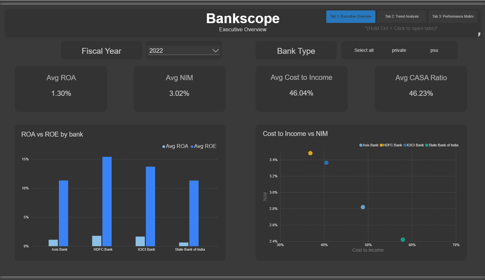
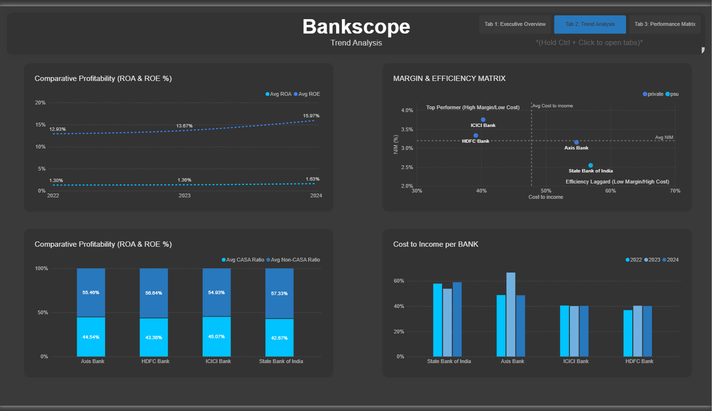
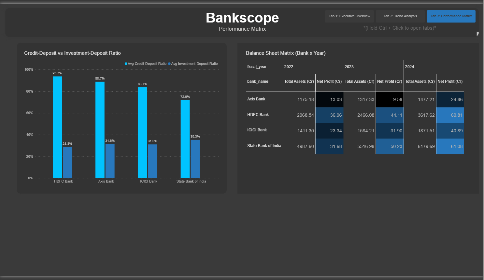

# BankScope — Indian Banking Sector Financial Analysis Platform

A comparative financial analysis tool for major Indian banks[cite: 8]. Extracts structured
financial data from official PDF annual reports, computes standard banking-sector
ratios, and presents peer comparisons through a Power BI dashboard[cite: 8].

## Dashboard


*Tab 1 — peer comparison snapshot for a selected fiscal year, with a margin/efficiency quadrant analysis (NIM vs. Cost-to-Income) beyond the original scope.*[cite: 8]


*Tab 2 — profitability and efficiency trends across FY2022–2024, including CASA composition by bank.*[cite: 8]


*Tab 3 — Credit-Deposit and Investment-Deposit ratios alongside a bank-by-year balance sheet matrix.*[cite: 8]

## Scope

**Banks covered:** HDFC Bank, ICICI Bank, State Bank of India, Axis Bank, Kotak
Mahindra Bank — a deliberate mix of private-sector and public-sector banks[cite: 8].

**Years:** 2022–2026 annual reports downloaded for all 5 banks[cite: 8]. The dashboard
itself uses **FY2022–2024** uniformly across the 4 banks it covers, so every
peer comparison spans the same window — see *Known constraints* for why[cite: 8].

**Source:** official Investor Relations pages of each bank[cite: 8].

## Architecture

```mermaid
flowchart TD
    A["PDF reports<br/>25 files, 5 banks x 5 years"] --> B["Extraction layer<br/>src/extraction.py"]
    B --> C["raw_line_items<br/>PostgreSQL"]
    C --> D["financial_facts<br/>src/normalize.py"]
    D --> E["computed_ratios<br/>src/compute_ratios.py"]
    E --> F["Power BI dashboard<br/>3 tabs"]
```[cite: 8]

1. **Data acquisition (manual)** — annual report PDFs downloaded from each bank's
   IR page into `data/raw_reports/{bank}/{BANK_YEAR}.pdf`[cite: 8].

2. **Extraction layer (`src/extraction.py`)** — locates the Balance Sheet, P&L,
   Cash Flow, and Schedule pages by searching for header text rather than
   trusting page numbers (which shift every year), then parses each into a
   clean DataFrame of line items[cite: 8].

3. **Storage layer (PostgreSQL, `sql/schema.sql`)** — a layered schema:
   `raw_line_items` (verbatim landing zone, full audit trail) →
   `financial_facts` (normalized to canonical keys) → `computed_ratios` (final
   output, with disclosed values alongside computed ones where available)[cite: 8].

4. **Loading (`src/load_to_db.py`, `src/normalize.py`)** — reads the extraction
   layer's output into `raw_line_items`, then normalizes it into
   `financial_facts` using RBI-mandated schedule numbering (Schedule 1 =
   Capital, Schedule 3 = Deposits, Schedule 13 = Interest Earned, etc.) as the
   primary key rather than label text, since label wording varies bank to bank[cite: 8].

5. **Ratio calculation (`src/compute_ratios.py`)** — reads `financial_facts`
   for each bank/year, computes the 7 ratios below, and writes them into
   `computed_ratios` (delete-then-insert per bank/year, same clean-slate
   re-run pattern as the loading and normalization steps)[cite: 8]. NIM here is
   computed as Net Interest Income ÷ Total Assets — a simplified proxy for
   the textbook formula (which divides by *average* interest-earning
   assets), used because the extraction layer captures each report's
   point-in-time Balance Sheet, not a computed average[cite: 8].
   ```bash
   python -m src.compute_ratios
   ```[cite: 8]

6. **Presentation (Power BI)** — connects directly to PostgreSQL via two views,
   `vw_powerbi_ratios` (long format, one row per bank/year/ratio) and
   `vw_powerbi_financial_facts_wide` (wide format, for KPI cards and tables)[cite: 8].

## Ratios computed

- Net Interest Margin (NIM)[cite: 8]
- CASA ratio[cite: 8]
- Return on Assets (ROA) / Return on Equity (ROE)[cite: 8]
- Cost-to-Income ratio[cite: 8]
- Credit-Deposit ratio[cite: 8]
- Investment-Deposit ratio[cite: 8]

**Deviation from the original plan, documented rather than hidden:** Gross/Net
NPA % and CRAR were originally scoped but require data that lives in MD&A
tables and Schedule notes the extraction layer doesn't parse yet (see *Known
constraints*)[cite: 8]. Rather than leave a gap, Credit-Deposit and Investment-Deposit
ratios were substituted — both genuinely computable from data already
extracted, and both meaningful liquidity/leverage metrics in their own right[cite: 8].

## Key Analytical Findings & Project Insights

- **Private vs. PSU Profitability & Efficiency Divide:**
  - **Outperformance in Margin & Efficiency:** Private sector leaders (ICICI Bank and HDFC Bank) consistently anchor the high-margin, high-efficiency quadrant[cite: 9]. ICICI Bank leads with strong Return on Assets (ROA) and Net Interest Margins (NIM) while keeping its Cost-to-Income ratio low (~39–40%)[cite: 9].
  - **Scale vs. Cost Overhead:** State Bank of India (SBI) commands an overwhelming asset scale (growing above ₹61.9L Cr in FY2024), but operates with a higher Cost-to-Income ratio (~53–55%) due to its extensive branch network and operating overhead[cite: 9].

- **Deposit Structure & Liquidity Dynamics:**
  - **CASA Ratio Stability:** All four benchmarked banks maintain strong low-cost deposit bases, holding Current Account Savings Account (CASA) ratios between 38% and 45%[cite: 9].
  - **Credit Deployment vs. Liquidity Buffers:** Private institutions maintain significantly higher Credit-Deposit ratios (83% to 93%), reflecting aggressive loan book growth compared to SBI (~72%)[cite: 9]. SBI balances this with a higher Investment-Deposit ratio (~35%), holding stronger sovereign debt and liquidity buffers[cite: 9].

- **Systemic Profit Expansion (FY2022–FY2024):**
  - **Earnings Recovery:** Net profits expanded across all four institutions across the 3-year window, led by major earnings growth in Axis Bank and ICICI Bank[cite: 9].
  - **Balance Sheet Growth:** Systemic total assets across the benchmarked institutions grew continuously, reflecting solid post-pandemic credit growth across the Indian banking landscape[cite: 9].

## Known constraints

Stated plainly, in keeping with this project's approach throughout:[cite: 8]

- **Not a live/automated pipeline.** Annual reports are published once a year[cite: 8].
  Data acquisition here is manual and infrequent by nature of the source
  material[cite: 8].

- **PDF extraction surfaced real, varied problems, not a rubber-stamp
  `read_pdf()` call.** Across 5 banks and up to 5 years each, the extraction
  layer had to handle: at least 4 distinct statement-header conventions (bare
  all-caps, dated Title Case, bare Title Case with the date on the next line,
  and two statement titles concatenated onto one line from a two-column
  layout); a genuine editorial typo in HDFC's own PDF ("Shedule" missing a
  "c"); a font-kerning artifact splitting "BALANCE" into "BAL ANCE"; false
  positives from Auditor's Reports citing schedule numbers in prose before
  the real financial statements begin; and a text-merge artifact that
  silently dropped a section header into the following line item's label[cite: 8].
  Each was root-caused against the actual extracted text before fixing, not
  guessed at — see `docs/progress.md` for the full history[cite: 8].

- **Kotak Mahindra is excluded from ratios and the dashboard.** Its Balance
  Sheet and P&L are laid out as two columns on a single page, which the
  current parser (built for single-column, sequential-page layouts) can't
  reliably split[cite: 8]. Its PDFs are still downloaded and loaded into
  `raw_line_items`, so the data exists — the column-splitting parser is
  scoped as future work, not silently dropped[cite: 8].

- **SBI's dashboard coverage is FY2022–2024, not the full FY2022–2026 range.**
  FY2025–2026 hit an unresolved statement-locator issue specific to those two
  years; rather than block the rest of the project on it, the dashboard uses
  the 3-year window all 4 covered banks share in common[cite: 8].

- **Standalone financials are used throughout**, not consolidated, so
  regulatory ratios stay comparable bank-to-bank on a like-for-like basis[cite: 8].

- **`disclosed_value` is schema-ready but not yet populated.** `computed_ratios`
  has a column for the bank's own directly-disclosed figure, as a planned
  accuracy check against the computed value — but populating it needs the
  MD&A-table extraction that also blocks NPA%/CRAR (see above), so
  `compute_ratios.py` currently writes `computed_value` only[cite: 8].

## Setup

```bash
python -m venv venv
source venv/bin/activate  # Windows: venv\Scripts\activate
pip install -r requirements.txt
```[cite: 8]

```bash
cp .env.example .env
# fill in your PostgreSQL credentials
psql -U postgres -d bankscope -f sql/schema.sql
```[cite: 8]

## Running the pipeline

```bash
python -m src.load_to_db        # PDFs -> raw_line_items (~20-30 min for all 25 files)
python -m src.normalize         # raw_line_items -> financial_facts
python -m src.compute_ratios    # financial_facts -> computed_ratios
```[cite: 8, 9]

Then open the `.pbix` file (or connect a fresh Power BI report to PostgreSQL
using `vw_powerbi_ratios` and `vw_powerbi_financial_facts_wide`)[cite: 8].

## Repo structure

bankscope/
├── data/
│   └── raw_reports/{bank}/{BANK_YEAR}.pdf   # gitignored — not committed
├── sql/
│   └── schema.sql
├── src/
│   ├── init.py
│   ├── config.py
│   ├── extraction.py          # statement locator + page-to-DataFrame parser
│   ├── load_to_db.py          # extraction output -> raw_line_items
│   ├── normalize.py           # raw_line_items -> financial_facts
│   ├── compute_ratios.py      # financial_facts -> computed_ratios
│   ├── test_locater_batch.py  # diagnostic: batch-tests the locator across every PDF
│   └── diagnose_headers.py    # diagnostic: dumps header-like lines for one PDF
├── docs/
│   ├── progress.md            # full build log: every bug found, root-caused, and fixed
│   └── screenshots/           # dashboard tab screenshots
├── requirements.txt
├── .env
├── .gitignore
└── README.md